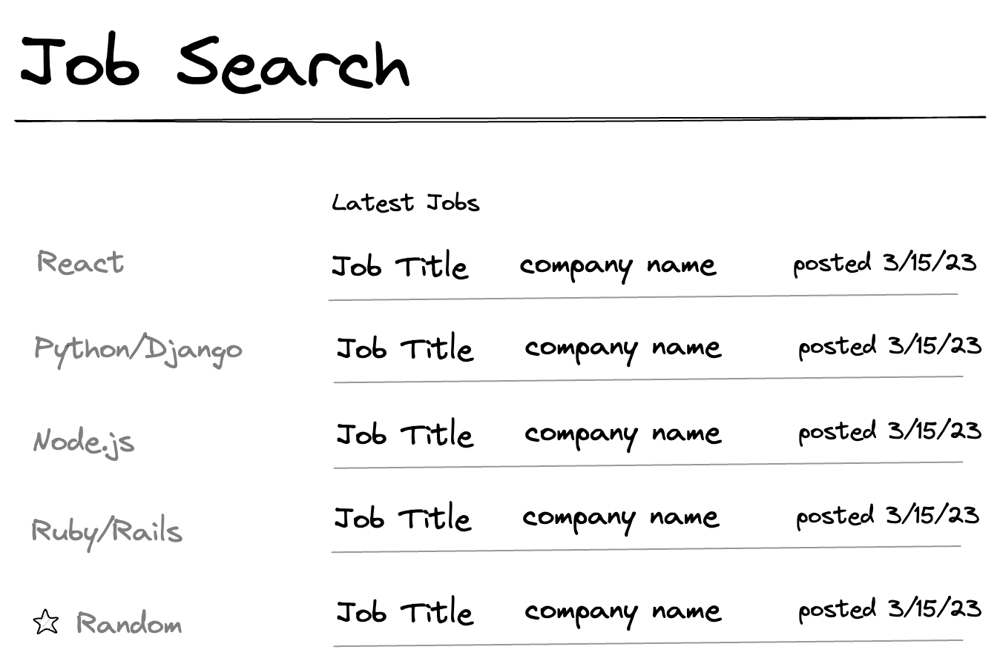
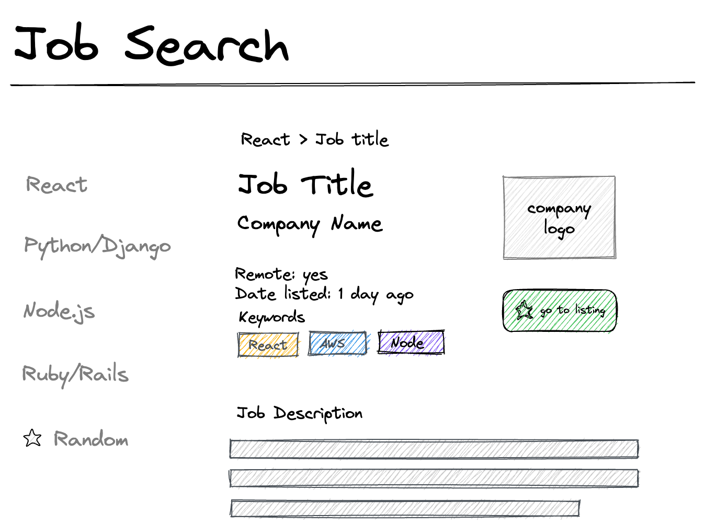

# React Jobs Search

For this project, you will build a mini job-search interface using an API to retrieve developer job listings in several different categories of your choosing.

## Get Started

You can use `create-react-app` to create this application or you can choose to use [Vite](https://vitejs.dev/), a newer and faster alternative for creating new React applications. [What is Vite and why should you use it instead of CRA?](https://luketheweb.dev/blog/what-is-vite-and-why-should-you-use-it-instead-of-create-react-app). Glad you asked. The React documentation has [changed its recommendation to Vite instead of create-react-app](https://github.com/reactjs/react.dev/pull/5487) for creating new applications.

[The Vite documentation](https://vitejs.dev/guide/) is straightforward and it is very similiar to create-react-app. You'll run `npm create vite@latest` and follow the prompts (choose "React" as your framework; for variant, select "JavaScript"). You'll have a `src` folder like you are used to and can install dependencies with `npm` in exactly the same way. To run the server, you will need to do `npm run dev` -- `npm start` will not work with Vite.

## Requirements

You'll use this API to power an application that lets a user see the top 6 most relevant jobs. Your application should have tab-style navigation and will allow a user to select a category to see job listings in that category. You should also implement an option to get a random job from the API -- how you implement this is up to you.

You should handle null or missing values gracefully -- that is, your UI should not look broken if data is missing.

Your application must be deployed to Netlify. 🚀

### FindWork API

[Documentation for the FindWork API](https://findwork.dev/developers/)

Go to the FindWork API and sign up for free access to their developer portal. The [documentation page](https://findwork.dev/developers/) will walk you through how to use the API. You will need to get an API key (available on the [documentation page](https://findwork.dev/developers/), just read the documentation to find the link) to make requests.

Your UI should show options in a sidebar for different keyword searches. You can choose whatever these searches are and hard-code them in your app.

When a user selects a category, your app will make a request to the FindWork API to get job listings in that category. You should show at least the first 5 or 6 listings that the API returns.

Your application must be styled. You might want to use a CSS library to help with styling, but you don't have to.

### Loading Indicator

Your UI should show some kind of [progress indicator](https://mui.com/material-ui/react-progress/), like a [spinner](https://www.davidhu.io/react-spinners/), an [animation](https://www.framer.com/motion/examples), a [loading skeleton](https://github.com/dvtng/react-loading-skeleton), or something else instead of a blank page while data is being requested from the API. You don't _have_ to use any of those libraries -- they are provided to give you some ideas -- but you do have to implement some kind of loading state and UI indication that data is being fetched.

### Tab Navigation

Job categories are shown on tabs. You'll preselect and hard-code several categories that you find interesting. Your user can click on a tab to see jobs in that category, corresponding to a keyword search in the FindWork API. For example, if you have a "React" tab, when that is selected, you will show job listings that result from making a request to `https://findwork.dev/api/jobs/?remote=true&search=react&sort_by=relevance`. Notice the query params.

Your tabs can be positioned vertically like in the wireframe or horizontally. When a category is selected, it should be highlighted somehow in the UI.

### Show a Random Job

Your application should allow your user to get a random job. [Amelia Wattenberger](https://wattenberger.com/)'s [dataset finder](https://dataset-finder.netlify.app/), based on the extremely interesting [Data Is Plural project](https://www.data-is-plural.com/), has [a great example of the kind of UI you could create to make this interaction interesting and delightful](https://dataset-finder.netlify.app/random).

### Example wireframes

Your app does not have to look exactly like this. These wireframes are provided to give you an idea of how this might look, but you can be creative in your adaptation of this basic design.

#### On load

When the application loads, the user should see category options. No category tab is selected yet. The jobs list shows the latest jobs, not filtered by category.

#### A list of jobs with React selected

When a user selects a category by clicking on the tab, that tab should be highlighted somehow to indicate that it has been selected. The jobs list should show only jobs in that category, listed displayed by title, company name and date listed.

#### One job selected

When a user clicks on a single job, the list is replaced with a detailed view of a single job. That view should include at least the job title, company name and logo (if available), job description, date listed, whether it is remote or not, and keywords associated with this listing. You should provide some way for the user to go back to the list of all jobs from here, such as [breadcrumb links](https://getbootstrap.com/docs/4.0/components/breadcrumb/) or just a link to go back to the list.

If you include a "go to listing" button, it can take the user to the job listing page on FindWork.dev using the URL provided by the API. The API does not include direct links to job applications.

## 🌶️ Spicy Options

- The API returns many more job listings than can be shown on the page at one time. Implement some way to handle that large number of listings. You might allow your user to see paginated results or maybe you want to try to implement infinite scroll. However you do this, you will need to make multiple API calls using the paginated response from the API.
- Provide additional sorting and filtering options. You can filter in the UI after fetching data or you can dig into the API and find other query params you could use to refine search results.
-
- Create a form to allow users to do custom keyword searches not provided in the tabs.
- Allow a user to bookmark job listings and save them using local storage. They should then be able to see a list of their bookmarked listings and delete listings they no longer want.
